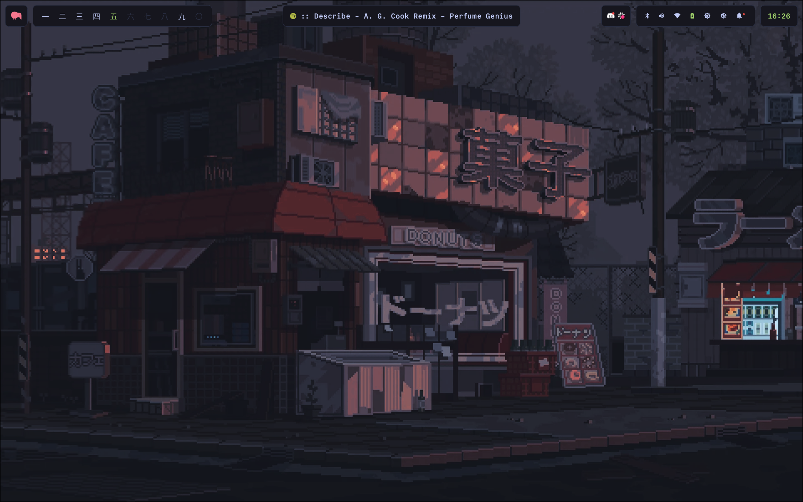
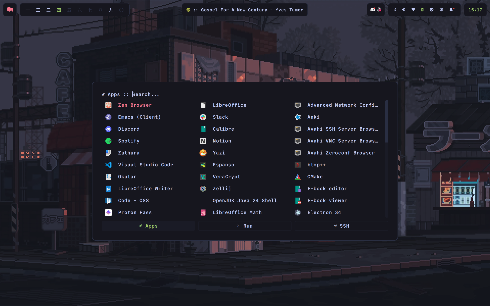
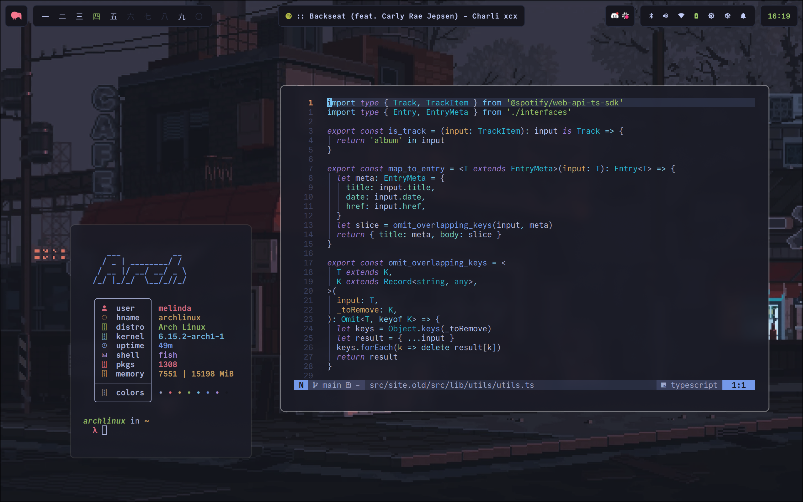
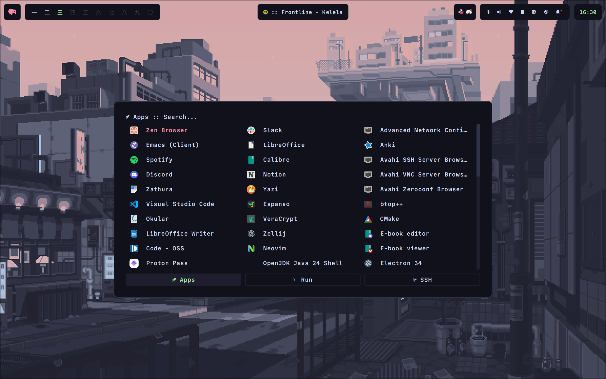
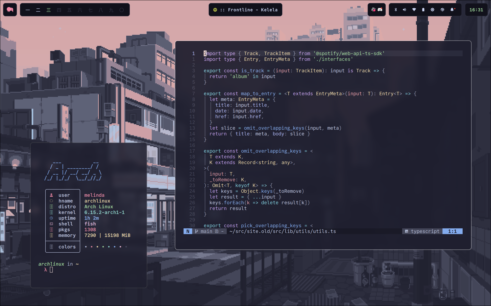

# dotfiles

Hyprland dots for personal use, including theme switching.

<table align="center" cellspacing="0" style="border-collapse: collapse !important; border-spacing: 0 !important;">
  <tr>
    <td colspan="2" align="center">
      
    </td>
  </tr>
  <tr>
    <td></td>
    <td></td>
  </tr>
  <tr>
    <td></td>
    <td></td>
  </tr>
  <tr>
    <td></td>
    <td></td>
  </tr>
</table>

## Information

### General
- OS: [Arch Linux](https://archlinux.org/)
- WM: [Hyprland](https://wiki.archlinux.org/title/Hyprland)
- Shell: [fish](https://wiki.archlinux.org/title/Fish)

### Programs
- Terminal: [foot](https://wiki.archlinux.org/title/Foot)
- Prompt: [starship](https://github.com/starship/starship)
- Launcher: [rofi-wayland](https://wiki.archlinux.org/title/Rofi)
- Bar: [waybar](https://wiki.archlinux.org/title/Waybar)
- File Manager: [yazi](https://github.com/sxyazi/yazi)
- Notifications: [swaync](https://github.com/ErikReider/SwayNotificationCenter)
- Lock: [swaylock](https://github.com/swaywm/swaylock)
- Wallpaper: [swww](https://github.com/LGFae/swww)
- Editor: [emacs-wayland](https://wiki.archlinux.org/title/Emacs), [neovim](https://wiki.archlinux.org/title/Neovim), [code](https://wiki.archlinux.org/title/Visual_Studio_Code)

### Theming
- System Font: [Commit Mono Nerd Font](https://archlinux.org/packages/extra/any/otf-commit-mono-nerd/)

At present, theme switching is supported for the following apps:
- btop
- foot
- Neovim
- rofi
- Spotify (via `spicetify-cli`)
- swww
- waybar
- yazi
- zathura
- zellij

...with the following color palettes:
- Catppuccin Mocha
- Gruvbox Material/Dark Medium
- Tokyo Night

NOTE: Used to support Doom Emacs, but I've since switched to a config based on [Emacs-Kick](https://github.com/LionyxML/emacs-kick) to use in the terminal. May re-implement something for GUI in the near future.

## Roadmap
- [ ] Implement Kanagawa-Paper flavors for yazi, tmux
- [ ] Emacs-Kick theme-switching integration

## Credits
Several modules (e.g., rofi, swaync) based off of [Axenide/Dotfiles](https://github.com/Axenide/Dotfiles/).
